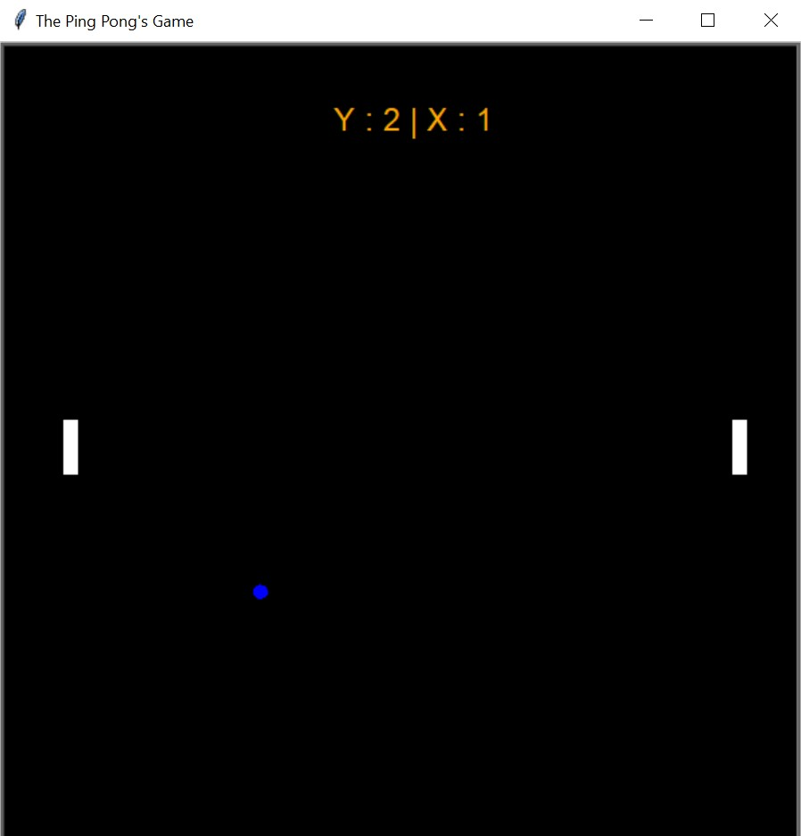

# ping-pong-game
a little game to understand some complexities of the module turtle... in python

**For more informations, you can check my code, there are some comments at each line to make you understand it**

_Thanks_
